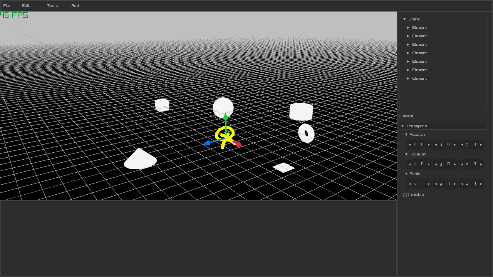

# Gorlot

Gorlot is a simple UI for the `raylib` library. It uses raylib as its rendering
engine and Nuklear for its editor.

Gorlot also have some functions that modifies the default parameters of some
elements in raylib, in order to make it more similar to an actual game engine,
the source of this "library" can be found in `lib/`.

## Dependencies

Gorlot has only two external dependencies (as Nuklear comes along with this
repository):

* [cglm](https://github.com/recp/cglm)
* [Raylib](https://github.com/raysan5/raylib)

## Screenshots

Gorlot is in a veeeeery early development phase, therefore, the following images
might now be outdated, therefore, the best way to always see the latest version
of Gorlot is by building from source.

## How to contribute?

You can contribute with changes in the code and donations.

If you want to contribute changes in the move, you can do so by forking
[this repo](https://codeberg.org/Bassara/Gorlot) and creating pull requests. Or
you can also send patches (only one file, please) to my
[email address](mailto:hermadescgco@disroot.org).

If you want to donate, you can find more information on how to do so in my
[personal website](https://zeabanger.gq/donate)
